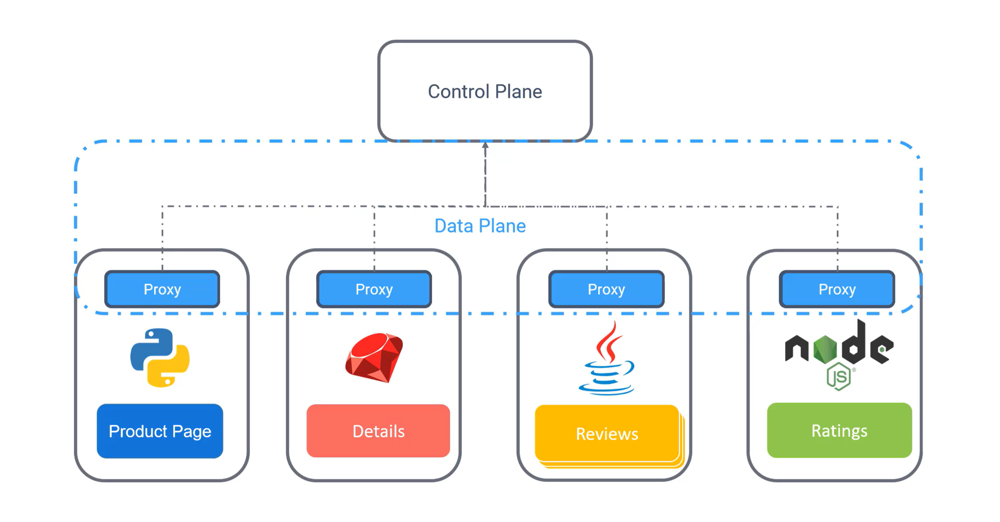
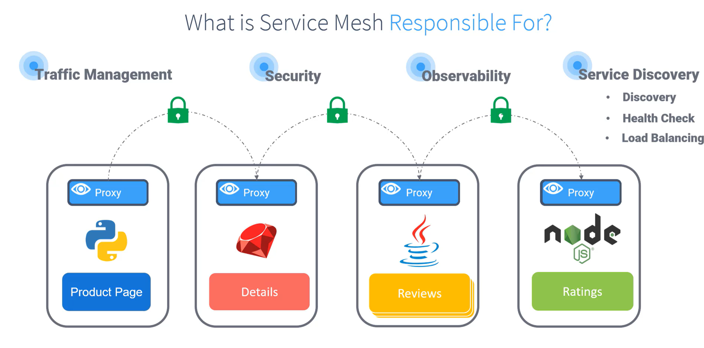

## Servis Mesh'in Tanımı ve Rolü

Bir servis mesh, mikroservis mimarilerindeki iletişim ihtiyaçlarını basitleştiren ve yöneten bir altyapı katmanıdır. Mikroservislerin her biri için farklı iletişim gereksinimlerini manuel olarak ele almak yerine, bu yükü **sidecar proxy** adı verilen bir aracıya devrederiz.

### Ana Bileşenler:
1. **Data Plane**: Servisler arasındaki iletişim, sidecar proxy'ler üzerinden gerçekleşir. Bu, tüm trafiği yöneten veri düzlemidir.
2. **Control Plane**: Proxy'ler ile iletişim kurarak tüm ağ trafiğini kontrol eder. İş mantığınızdan bağımsız olarak ağ logiğini yönetir.

## Servis Mesh'in Avantajları
- **Dinamik Yapılandırma**: Mikroservislerin iletişim yöntemlerini kodu değiştirmeden dinamik olarak yapılandırabilirsiniz.
- **Gelişmiş Güvenlik**: Servisler arasındaki iletişim için mutual TLS kullanarak güvenli bir ağ elde edersiniz.
- **Gözlemlenebilirlik**: Uygulamanızın uçtan uca performansını izleyebilir ve sorunları belirleyebilirsiniz.
- **Servis Keşfi**: IP ve port bilgilerini dinamik olarak keşfetme ve kullanma.

## Dinamik Cluster İhtiyaçları
- **Health Check**: Servislerin durumu sürekli kontrol edilerek, sadece çalışan servislerin mesh'te kalması sağlanır.
- **Load Balancing**: Trafiği sağlıklı olan instancelara yönlendirir ve başarısız olanları devre dışı bırakır.

