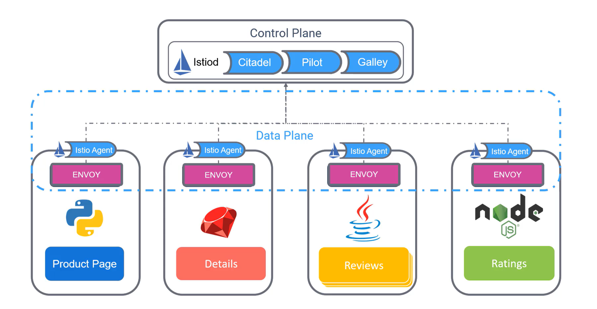

## Istio Nedir?

Istio, **ücretsiz ve açık kaynak** bir servis mesh çözümüdür. Servisler arasında **güvenli iletişim, bağlantı ve izleme** sağlayarak karmaşık dağıtımlarda evrensel trafik yönetimi ve güvenlik sunar.

---

## Istio'nun Temel Özellikleri

- **Secure, connect ve monitor**: Servisler arasında güvenli, izlenebilir ve yönetilebilir bağlantılar oluşturur.
- **Uyumluluk**: Kubernetes ve traditional workloads ile çalışabilir.
- **Destek ve uygulama**: Başlıca bulut providerlerı tarafından desteklenir.

---

## Istio Mimarisi

### 1. **Data Plane**
- **Proxy'ler**: Mikroservisler arasındaki iletişim, **sidecar proxy** bileşenleri üzerinden sağlanır.
- **Envoy**: Istio, bu proxy'leri yüksek performanslı bir açık kaynak çözüm olan Envoy ile uygular.

### 2. **Control Plane**
- Proxy'lerin yönettiği tüm trafiği kontrol eden bir **sunucu tarafı bileşenidir**.
- **Istiod**: Control plane'in merkezi bileşenidir.

---

## Istio'nun Orijinal Bileşenleri

Başlangıçta Istio’nun control plane’i üç temel bileşenden oluşuyordu:
1. **Citadel**: Sertifika oluşturma ve yönetimi.
2. **Pilot**: Servis keşfi ve trafik yönetimi.
3. **Galley**: Yapılandırma dosyalarının doğrulanması.

Bu üç bileşen daha sonra **Istiod** adı verilen tek bir bileşen altında birleştirildi.

---

## Istio Agent

- Her servis veya port, bir **Envoy proxy** ve bir **Istio Agent** ile birlikte çalışır.
- **Istio Agent**, yapılandırma bilgilerini Envoy proxy'lerine iletmekten sorumludur.

